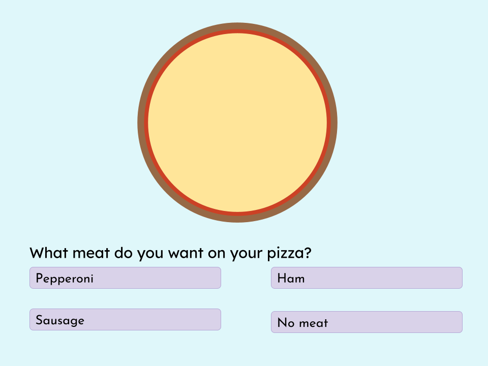
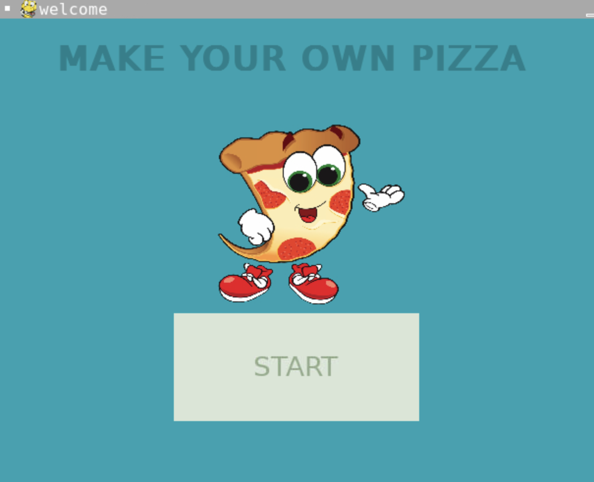

:warning: Everything between << >> needs to be replaced (remove << >> after replacing)
# CS110 Project Proposal
# Make Your Own Pizza
## CS 110 Final Project
### Fall 2022
### [Assignment Description](https://docs.google.com/document/d/1H4R6yLL7som1lglyXWZ04RvTp_RvRFCCBn6sqv-82ps/edit?usp=sharing)

<< [[repl](#)](https://github.com/bucs110FALL22/final-project-sonia_and_kyle_final_project.git) >>

<< [link to demo presentation slides](#) >>

### Team: Sonia & Kyle
#### Sonia Rai and Kyle Mejorada

***

## Project Description

The object of the game is simply to create your own pizza. Choose between many different sauce and topping options to customize your pie!

***    

## User Interface Design

- **Initial Concept**
  
    
    
- **Final GUI**
  
  
  
***        

## Program Design

* Non-Standard libraries
    * << You should have a list of any additional libraries or modules used (pygame, request) beyond non-standard python. 
         For each additional module you should include
         - url for the module documentation
         - a short description of the module >>
* Class Interface Design
    * << A simple drawing that shows the class relationships in your code (see below for an example). This does not need to be overly detailed, but should show how your code fits into the Model/View/Controller paradigm. >>
        *  
* Classes
  Button
## Project Structure and File List

The Project is broken down into the following file structure:

* main.py
* src
  * screens
  * saucescreen.py
  * scscreen.py
  * tpscreen.py
    * crust.py
    * ham.py
    * mushroom.py
    * pepperoni.py
    * pineapple.py
    * sausage.py
    * spinach.py
    * tomato.py
* assets
  * crust.png
  * ham.png
  * mushroom.png
  * pepperoni.png
  * pineapple.png
  * sausage.png
  * spinach.png
  * tomato.png

***

## Tasks and Responsibilities 
Collaborated on all the code, not much done individually.
   

## Testing
Worked on individual screens together and debugged each block of code before moving on to another screen. 

## ATP

| Step                 |Procedure             |Expected Results                   |
|----------------------|:--------------------:|----------------------------------:|
|  1                   | Run Program  |GUI window appears with start button  |
|  2                   | click start button   | display changes to sauce screen      |
|  3                   | click any of the sauce options  |  whichever sauce is clicked is recorded  |
|  4                   | click next button  |  display changes to toppings screen  |
|  5                   |  click back button  |  display is changed to welcome screen  |
|  6                   |  click any of the topping options  |  whichever topping is clicked is recorded  |
|  7                   | click next button  |  display changes to pizza screen  |
|  8                   |  click back button  |  display is changed to sauce screen  |

